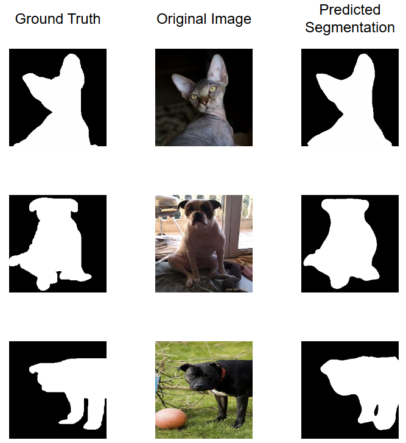

# CV Mini Project: Point-prompted Segmentation

## Project Overview

In this project, we implemented and compared several deep learning models for **semantic image segmentation** using the [Oxford-IIIT Pet Dataset](https://www.robots.ox.ac.uk/~vgg/data/pets/).  
The objective was to accurately segment pet images into three classes: **background**, **cat**, and **dog**.

### Approaches Explored

We explored a variety of model architectures and training strategies:

- **Custom UNet**  
  A UNet model enhanced with **ResNet-style skip connections**, and attention-based **downsampling** and **upsampling** blocks to improve feature representation.
  


- **MAE-Seg (Masked Autoencoder Segmentation)**  
which learns robust features by reconstructing randomly masked image regions. We froze the encoder used a query-based decoder inspired by recent works, introducing learnable mask tokens that interact with image tokens via a Transformer to extract semantic regions.


- **CLIP-Seg**  
  a cross-modal model with both image and text encoders. The approach we adopted was by replacing the encoder in the second MAE-based method with CLIP’s image encoder while keeping the decoder structure unchanged.

- **Point-prompted UNet Segmentation**  
  A UNet-based model that incorporates **user-provided point prompts** (converted into heatmaps) to guide the segmentation process interactively.


## Example Results from our models

- **UNet**


- **MAE-Seg**


- **CLIP-Seg**



- **Point-prompted UNet Segmentation** 


## 🛠️ Installation Guide

This project uses a **Docker-based environment** with **CUDA 12.1**, **Python 3.10**, and all necessary dependencies pre-installed for ease of use and reproducibility.

### 🚀 Step-by-Step Installation (Using Docker)

#### 1. Clone the repository

```bash
git clone https://github.com/JingyuSunUOE/CV-mini-Project.git
cd your-repo-name
```
#### 2. Build the Docker image
Make sure you have Docker and NVIDIA Container Toolkit installed.
```bash
docker build -t your-image-name .
```
Replace your-image-name with a name you prefer for your Docker image.

#### 3. Run the Docker container
```bash
docker run --gpus all -it \
  --shm-size=64g \
  --name your-container-name \
  -v $(pwd):/mto/your/workdir \
  -v /path/to/your/output:/output \
  your-image-name
```
Replace /path/to/your/output with the directory on your local machine where you want to store outputs.

#### 4. Python Environment
Inside the container, a Python 3.10 virtual environment is already activated at /opt/venv.
To verify:
```bash
which python
# Expected: /opt/venv/bin/python

pip list
# To check installed dependencies
```

## Web Demo for Point-prompted Segmentation

The `Point-prompted-Segmentation` folder contains the UI application and guidance for the online version.  

For setup and usage instructions, please refer to [`Point-prompted-Segmentation/README.md`](Point-prompted-Segmentation/README.md).

## Model Checkpoint

There are four models available for download, one for each task. These can be loaded using the following code:

Click the links below to download the checkpoint for each model type:

-  [Task A-Unet](https://drive.google.com/file/d/1TzLWVhDlDCgVGdgeEuVT5QapwZiGuV0v/view?usp=sharing)
-  [Task B-MAE_Mask](https://drive.google.com/file/d/1Tc3lFL0jfD7azcKu9JH96zi7UhTCtgjB/view?usp=sharing))
-  [Task C-CLIP_Mask](https://drive.google.com/file/d/1CBlXLdvBBYcro857_euqRNwH9FGevU2s/view?usp=sharing)
-  [Task D-Unet_Point](https://drive.google.com/file/d/1Ay4fRrAwJOhVoijEk4BswEFKQ58gk0-1/view?usp=sharing)

## Dataset

The dataset used in this project is the [Oxford-IIIT Pet Dataset](https://www.robots.ox.ac.uk/~vgg/data/pets/), which contains images and pixel-level annotations for 37 categories of pet breeds.

We also provide our **preprocessed version** of the dataset, which can be downloaded from the following Google Drive link:

🔗 [Download Preprocessed Dataset (Google Drive)](https://drive.google.com/file/d/1Narxec5YWPuzLBeXO7NokIP0mZh1ljIH/view?usp=sharing)
